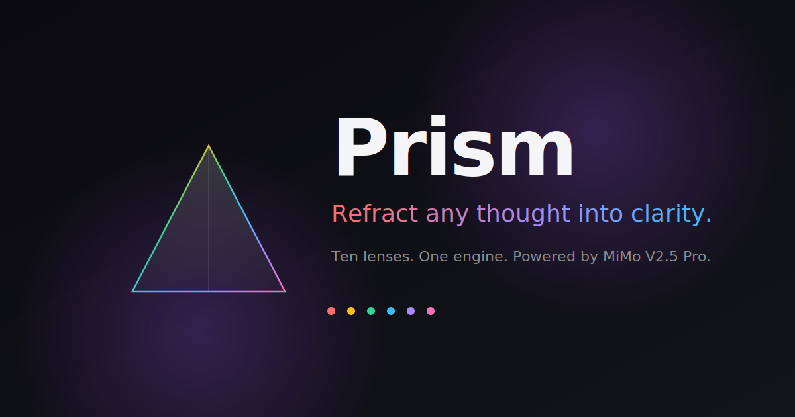

<div align="center">



# Prism

### *Refract any thought into clarity.*

A reasoning canvas powered by **MiMo V2.5 Pro**. Ten lenses. One engine.
Turn any input — a wallet address, a research paper, a vague idea — into structured insight.

[](https://nextjs.org)
[](https://platform.xiaomimimo.com)
[](https://vercel.com)
[](LICENSE)

</div>

---

## ✨ What is Prism?

Most AI tools are chat boxes. Prism isn't.

Prism is a **reasoning canvas**: pick a *lens*, drop your input, and watch MiMo V2.5 Pro refract it into a structured, domain-specific analysis. Same engine, ten different cognitive frames — built so you can see breadth of reasoning, not just chat completion.

> **Ten lenses. One engine. Infinite use cases.**

## 🔮 The Lenses

| Lens | Status | What it does |
|------|:------:|--------------|
| 🪙 **Chain Lens** | ✅ Live | Wallet/contract → behavioral biography, risk profile, network map |
| ⚔️ **Debate Lens** | ✅ Live | Any claim → Steel-man, Devil's Advocate, Skeptic, Supporter |
| 📐 **Spec Lens** | ✅ Live | Plain-English idea → PRD, architecture, API schema, tickets |
| 🧩 **Task Lens** | ✅ Live | Vague goal → recursive task tree, dependencies, daily plan |
| 🎯 **Alpha Lens** | 🔜 Soon | Topic → emerging narrative + momentum signals |
| 📜 **Thread Lens** | 🔜 Soon | URL/PDF/YouTube → viral-shaped X thread |
| 🏛️ **Legacy Lens** | 🔜 Soon | Legacy code → *why* it exists + refactor plan |
| 📄 **Paper Lens** | 🔜 Soon | arXiv paper → 5-level explainer + critique |
| 🔄 **Pivot Lens** | 🔜 Soon | Business idea → market scan + 5 pivots + kill criteria |
| 🌙 **Dream Lens** | 🔜 Soon | Free-form thought → symbolism + pattern map |

## 🧠 Why MiMo V2.5 Pro?

Prism is intentionally designed to **showcase deep reasoning**, not surface-level chat completion. Every lens forces multi-step structured reasoning across a different domain — on-chain analysis, adversarial debate, system design, recursive decomposition.

That breadth × depth is exactly where MiMo V2.5 Pro shines: it streams a visible **reasoning trace** before producing the final structured output, so users see *how* the model thinks, not just *what* it says.

## 🛠 Tech Stack

- **Framework:** [Next.js 16](https://nextjs.org) (App Router) + TypeScript
- **Styling:** Tailwind CSS v4 + custom spectrum theming
- **Animation:** Framer Motion
- **Icons:** Lucide
- **Toasts:** Sonner
- **Reasoning:** MiMo V2.5 Pro via Xiaomi MiMo Open Platform
- **Deployment:** Vercel (Edge-friendly Server-Sent Events streaming)

## 🚀 Getting Started

### Prerequisites
- Node.js 20+
- A MiMo Open Platform API key — get one at [platform.xiaomimimo.com](https://platform.xiaomimimo.com)

### 1. Clone and install

```bash
git clone https://github.com/XinnBlueBird/prism.git
cd prism
npm install
```

### 2. Configure environment

```bash
cp .env.example .env.local
```

Then edit `.env.local`:

```env
MIMO_API_KEY=your-mimo-api-key-here
MIMO_API_BASE=https://token-plan-sgp.xiaomimimo.com/v1
MIMO_MODEL=mimo-v2.5-pro
```

> 🔒 `.env.local` is gitignored. **Never commit real keys.**

### 3. Run locally

```bash
npm run dev
```

Open [http://localhost:3000](http://localhost:3000) — pick a lens, drop input, watch it refract.

### 4. Deploy

```bash
vercel deploy
```

Add `MIMO_API_KEY`, `MIMO_API_BASE`, `MIMO_MODEL` as **Environment Variables** in your Vercel project settings.

## 🏗 Architecture

```
┌───────────────────────────────────────────────────────┐
│                    Prism Frontend                      │
│              (Next.js App Router + Vercel)             │
│   Lens Picker  →  Input Forms  →  Streaming Canvas    │
└────────────────────────┬──────────────────────────────┘
                         │
┌────────────────────────▼──────────────────────────────┐
│              /api/reason  (SSE streaming)              │
│   • Lens routing   • Prompt assembly                   │
│   • Schema enforcement  • Reasoning + content split    │
└────────────────────────┬──────────────────────────────┘
                         │
                ┌────────▼─────────┐
                │   MiMo V2.5 Pro  │
                │   (api-key auth) │
                └──────────────────┘
```

### Project structure

```
src/
├── app/
│   ├── api/reason/route.ts   # SSE streaming endpoint
│   ├── lens/[id]/page.tsx    # Dynamic lens page
│   ├── page.tsx              # Landing
│   ├── layout.tsx            # Root + fonts + toaster
│   └── globals.css           # Spectrum theme
├── components/
│   ├── prism-logo.tsx        # Animated SVG prism
│   ├── lens-card.tsx         # Grid card
│   └── lens-runner.tsx       # Two-panel input/output runner
└── lib/
    ├── lenses.ts             # Lens catalog + system prompts
    ├── mimo.ts               # MiMo streaming client
    └── utils.ts              # cn() helper
```

## 🎨 Design Philosophy

- **Dark, calm, cinematic** — built for thinkers, not flashy
- **Spectrum accent** — single visual motif (the prism) carried across logo, headings, lens accents
- **Reasoning is the demo** — the streaming "thinking" panel is a deliberate UX choice that makes the model's depth tangible
- **No signup friction** — try any live lens instantly

## 🤝 Contributing

This is currently a focused project. Feedback and bug reports are welcome via [Issues](https://github.com/XinnBlueBird/prism/issues).

## 📜 License

MIT — see [LICENSE](LICENSE).

## 🙏 Acknowledgements

- [MiMo Open Platform](https://platform.xiaomimimo.com) for the reasoning engine
- [shadcn](https://ui.shadcn.com) for design inspiration
- The open-source maintainers behind Next.js, Tailwind, Framer Motion, Lucide, and Sonner

---

<div align="center">

**Built with curiosity. Refract everything.**

</div>
